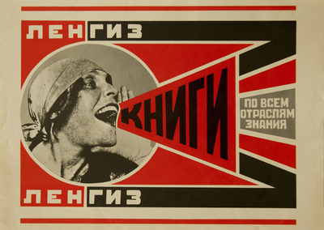
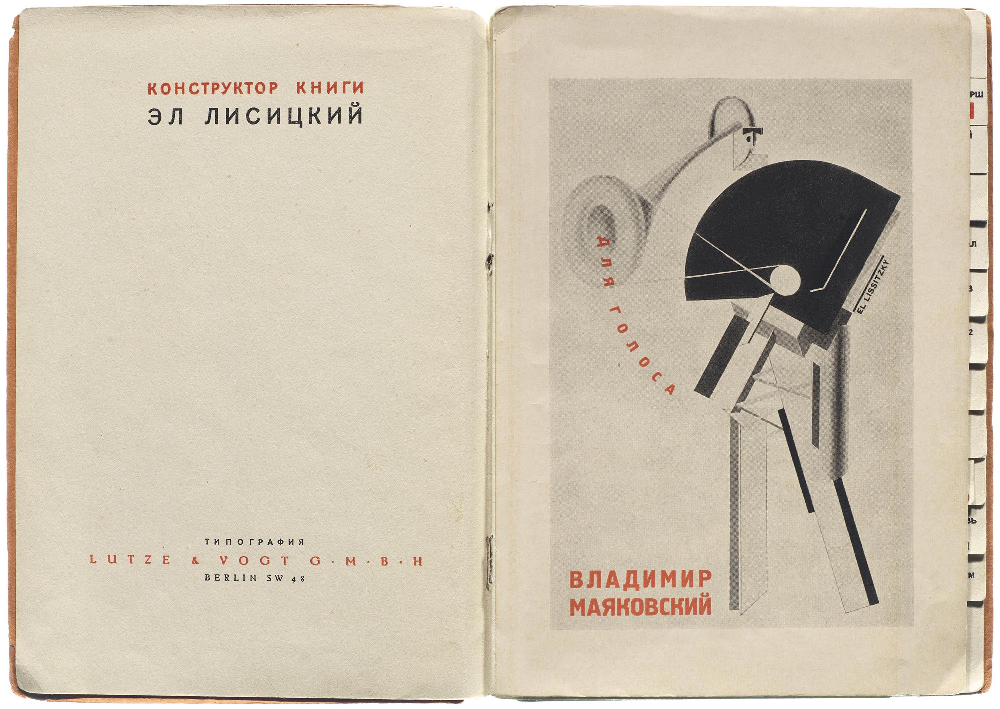

# Constructivism

[Home](../README.md)

## What it is

Constructivism developed in the Russian avant-garde around the October Revolution of 1917. Its artists treated art as something to construct for a social or practical purpose. Instead of focusing only on individual expression, they explored how design could participate in building a new society. [MoMA's overview](https://www.moma.org/collection/terms/constructivism) connects the movement to this idea of the artist as an engineer.

Constructivism belongs to modernism through its rejection of traditional ornament, use of abstract geometry, and interest in modern materials and production. Its graphic language appeared in books, advertising, and political communication. The historical context matters: these forms were connected to revolutionary ambitions, not simply a preference for red triangles. [National Galleries of Scotland](https://www.nationalgalleries.org/art-and-artists/glossary-terms/constructivism) explains the movement's industrial and political aims.

## Recognize and apply it

The features below focus on Constructivist graphic design. The hero applications are proposed adaptations, not claims made by the museums.

| Visual feature | When and why to use it | How to apply it in a hero |
|---|---|---|
| **Geometric structure and directional shapes** | Useful when a composition should suggest energy or action. Circles, wedges, and diagonals establish relationships between elements. | Put a product or person in a circular crop and use an angled panel to connect the image with the headline. Keep the CTA on a stable, readable surface. |
| **A limited, contrasting palette** | Useful when a few elements need strong emphasis. The examples below combine red, black, and light paper rather than many competing colors. | Use a light background, dark supporting text, and one red accent for the main action. Use spacing as well as color to distinguish the CTA. |
| **Typography assembled with imagery** | Useful when the message should feel active and integrated into the design. Letter size, orientation, and placement become part of the composition. | Pair a large, bold headline with a photographic cutout or geometric illustration. Let the headline interact with the image while keeping longer copy horizontal and legible. |

This approach could suit a workshop, creative event, or brand emphasizing action and change. A successful adaptation should explain the offer clearly; dramatic angles alone do not make a useful hero.

## Historical examples

### 1. Aleksandr Rodchenko — *Lengiz. Books in All Branches of Knowledge*

- **Creator:** Aleksandr Mikhailovich Rodchenko.
- **Title:** *Lengiz. Books in All Branches of Knowledge*.
- **Date and institution:** RISD's Fleet Library, Visual + Material Resources record dates the work to **1925** and lists silkscreen as its technique.
- **Direct source and viewing link:** [RISD collection record](https://digitalcommons.risd.edu/picturecollection_russianposters/13/).
- **Image credit:** Image supplied by Fleet Library / Visual + Material Resources, Rhode Island School of Design; artwork by Rodchenko. [Downloaded image source](https://digitalcommons.risd.edu/picturecollection_russianposters/1012/preview.jpg).
- **Reuse terms:** The RISD item page does not state an open reuse license. This local preview is included as the object of educational analysis; it is not labeled public domain or licensed for unrestricted reuse.
- **Date clarification:** The [Frye Art Museum record](https://fryemuseum.org/artwork/books-please-2015.010S.30) dates the design to **1924** and its own reproduction to **1967**. The image above comes from RISD, not the Frye reproduction; the records' dates should not be silently combined.

**What I observe:** A circular photograph anchors the left side. The woman's mouth meets the narrow end of a wedge that expands toward the right, making the large lettering feel like a projected voice. Repeated red and black bands frame the message.

**How I would adapt it in a hero:** I would place a photographic cutout beside a widening geometric panel containing the headline. That panel would connect the subject to the offer, while a separate rectangular CTA would keep the next step easy to identify. I would create new imagery and copy rather than reproduce the poster's wording.

### 2. El Lissitzky — *Dlia golosa (For the Voice)*, 1923

- **Creator:** El Lissitzky, book design and illustrations; Vladimir Mayakovsky, poems.
- **Title and date:** *Dlia golosa (For the Voice)*, **1923**.
- **Institution and historical record:** The Museum of Modern Art, New York; object **280.2001.1–25**, Gift of The Judith Rothschild Foundation. MoMA describes a book with twenty-five letterpress illustrations, including the cover.
- **Direct collection link:** [MoMA collection record](https://www.moma.org/collection/works/14473).
- **Image source and credit:** El Lissitzky / Vladimir Mayakovsky, image sourced from Letterform Archive via [Wikimedia Commons, “For the Voice.jpg”](https://commons.wikimedia.org/wiki/File:For_the_Voice.jpg). This is not a download of MoMA's collection photograph.
- **Reuse terms:** The Commons file page marks this image **public domain**, using the Public Domain Mark, and provides its source and copyright explanation. The downloaded image is unaltered.
- **Additional archive context:** [Letterform Archive's discussion and image gallery](https://letterformarchive.org/news/utopian-construction-judaism-and-the-soviet-avant-garde/).

MoMA explains that the poems were intended for reading aloud and that Lissitzky designed a thumb index to help readers find them. This connects experimental graphic design to a practical task: navigating the book.

**What I observe:** The spread contrasts a mostly open left page with a dense geometric construction on the right. Red lettering punctuates the black and gray shapes, and the visible index tabs give the outer edge a repeated rhythm. The asymmetry feels deliberate rather than randomly scattered.

**How I would adapt it in a hero:** I would balance a large geometric illustration on one side with open space for the headline and supporting copy on the other. A restrained red accent would connect the headline to the CTA. The index suggests a broader lesson for a later website: expressive design should still help visitors find what they need.

## Sources

Historical information comes from the institutional records below. “What I observe” and hero applications are interpretations of the pictured works.

- [MoMA — Constructivism](https://www.moma.org/collection/terms/constructivism): movement and social purpose.
- [National Galleries of Scotland — Constructivism](https://www.nationalgalleries.org/art-and-artists/glossary-terms/constructivism): modern materials, geometry, and historical context.
- [RISD — Lengiz poster](https://digitalcommons.risd.edu/picturecollection_russianposters/13/): poster metadata and displayed image.
- [Frye Art Museum — Books (Please)!](https://fryemuseum.org/artwork/books-please-2015.010S.30): alternative date and identification of its later reproduction.
- [MoMA — For the Voice](https://www.moma.org/collection/works/14473): book metadata and navigation design.
- [Letterform Archive — Utopian Construction](https://letterformarchive.org/news/utopian-construction-judaism-and-the-soviet-avant-garde/): Lissitzky's book design and source imagery.
- [Wikimedia Commons — For the Voice.jpg](https://commons.wikimedia.org/wiki/File:For_the_Voice.jpg): downloaded image provenance and reuse designation.

Images retrieved October 2, 2026. Both images reproduce historical works; neither is AI-generated.
