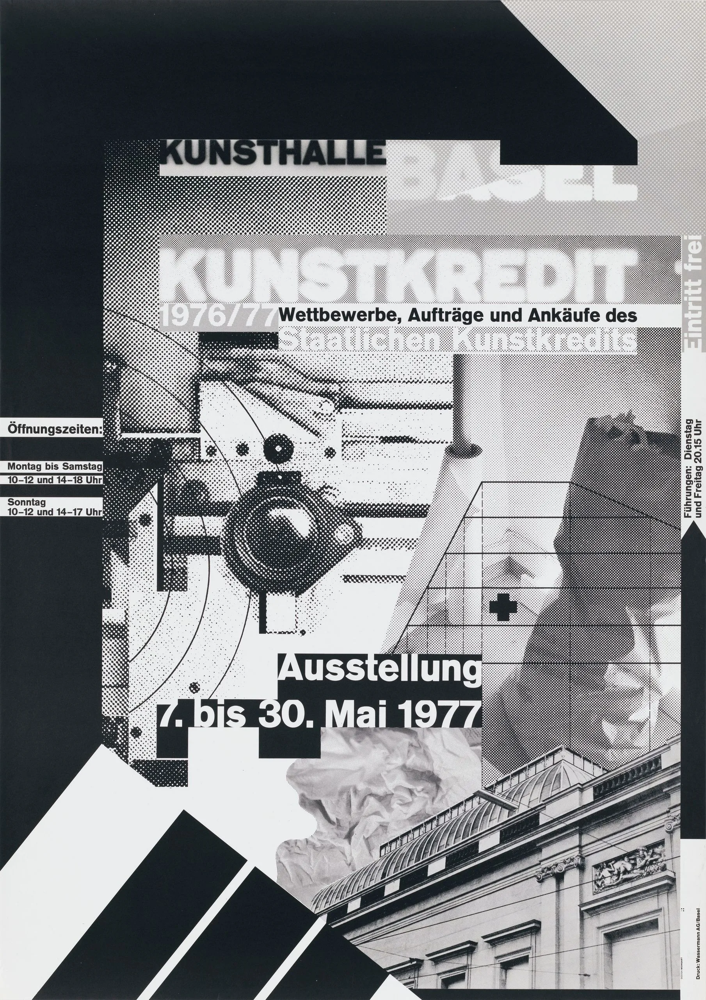
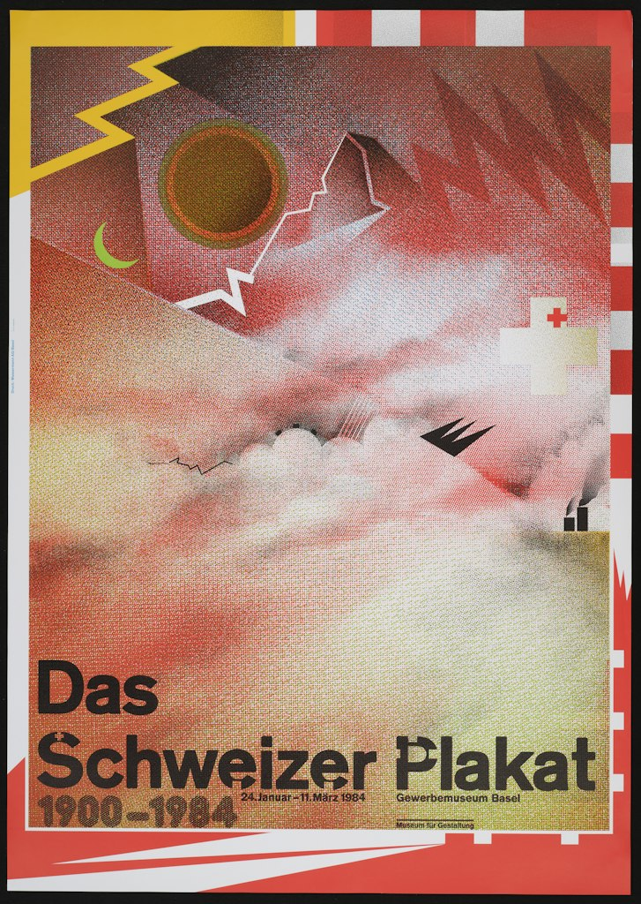

# New Wave Typography

[Home](../README.md)

## What it is

New Wave typography grew from experiments that challenged the rules of modern graphic design. Wolfgang Weingart helped establish its beginnings in Basel, Switzerland, in the late 1960s. Designers explored irregular letter spacing, unexpected text directions, and compositions that departed from a rigid grid. [Cooper Hewitt's history](https://exhibitions.cooperhewitt.org/willismith/williwear-new-wave-graphics/) traces how these ideas influenced designers in the United States and became part of postmodern graphic design.

Its relationship to modernism is both a continuation and a challenge. New Wave designers retained an interest in typography and structure while making layouts more expressive and complex. It differs from the restrained Swiss/International Typographic Style already covered in this guide. [LACMA's discussion of Weingart](https://collections.lacma.org/object/207622) explains how he combined printing knowledge with experiments in layering, spacing, and image texture.

## Recognize and apply it

The hero applications below are my proposed adaptations of the historical examples.

| Visual feature | When and why to use it | How to apply it in a hero |
|---|---|---|
| **Experimental typography and alignment** | Useful when a short message should convey individuality or creative energy. Changes in scale, spacing, and direction make words part of the visual composition. | Offset a large headline from the main image or change the scale of one key word. Keep supporting copy and the CTA consistently aligned. |
| **Layered text and imagery** | Useful when a design should suggest depth or several related ideas. Overlapping fragments create relationships beyond a simple row of separate elements. | Combine a photographic cutout with geometric panels and selected headline overlaps. Give the offer and button their own clear space. |
| **Visible printing textures** | Useful when a brand should feel experimental or connected to printmaking. Halftone dots and overlapping patterns make the construction of the image visible. | Add a halftone treatment to the main image or one background panel, keeping small text and the CTA free of busy textures. |

This style could suit a design studio, art exhibition, or creative portfolio. The layout should still help visitors understand the offer. I would use a few deliberate disruptions rather than making every element compete for attention.

## Historical examples

### 1. Wolfgang Weingart — *Kunstkredit Basel 1976/77*, 1977

- **Creator:** Wolfgang Weingart.
- **Title and date:** *Kunstkredit Basel 1976/77*, **1977**.
- **Institution:** Los Angeles County Museum of Art (LACMA), accession **M.2015.102.6**.
- **Medium:** Offset lithograph.
- **Direct source and viewing link:** [LACMA collection record](https://collections.lacma.org/object/207622).
- **Image credit:** Artwork by Wolfgang Weingart; image provided by Museum Associates/LACMA. Collection gift of Allison and Larry Berg and Mark and Maura Resnick through the 2015 Decorative Arts and Design Acquisition Committee.
- **Downloaded image:** [LACMA image file](https://collections-images.lacma.org/images/207622/207622-1-primary.webp).

**What I observe:** Large words sit on overlapping strips, while smaller information appears at different edges and orientations. Halftone dots connect photographic fragments with abstract shapes. The heavy black areas frame the composition, but the imagery and text interrupt one another instead of staying in separate columns.

**How I would adapt it in a hero:** I would layer a halftone product image with two offset headline panels. The supporting sentence and CTA would share a plain rectangular area, so the visitor could understand the offer even if the surrounding composition feels experimental.

### 2. Wolfgang Weingart — *Das Schweizer Plakat*, 1984

- **Creator:** Wolfgang Weingart.
- **Title and date:** *Das Schweizer Plakat*, **1984**.
- **Institution:** Walker Art Center.
- **Source and viewing link:** [Walker Art Center's Weingart collection](https://www.walkerart.org/collections/artist/wolfgang-weingart/). This page lists separate 1983 and 1984 works; the image used here is the **1984** entry.
- **Image credit:** Artwork by Wolfgang Weingart; image provided by Walker Art Center.
- **Downloaded image:** [Walker Art Center image file](https://imgix-proxy.walkerart.org/wac_44898.tif?fit=fit&fm=jpg&h=1024&w=1024).

**What I observe:** Red and yellow borders surround a grainy field of overlapping forms. Jagged lines, circular shapes, and crosses interrupt the textured imagery. The large black title remains recognizable near the bottom, creating a clear anchor within the more complex picture.

**How I would adapt it in a hero:** I would use a layered, textured illustration above a bold headline, with one accent color repeated in the border and button. The title's clear placement suggests a useful approach: keep the main message stable while allowing more experimentation around it.

## Sources

The institutional sources support the historical context and identification of the works. “What I observe” and hero applications are interpretations of the pictured posters.

- [Julie Pastor, Cooper Hewitt — WilliWear New Wave Graphics](https://exhibitions.cooperhewitt.org/willismith/williwear-new-wave-graphics/): New Wave's origins, challenges to modernist typography, and influence on postmodern graphics.
- [LACMA — Kunstkredit Basel 1976/77](https://collections.lacma.org/object/207622): artwork metadata and Staci Steinberger's discussion of Weingart's printing techniques and experimental compositions.
- [Walker Art Center — Wolfgang Weingart](https://www.walkerart.org/collections/artist/wolfgang-weingart/): image and date for the 1984 *Das Schweizer Plakat*.

Images downloaded from LACMA and Walker Art Center for this project. Both reproduce historical works; neither is AI-generated.
