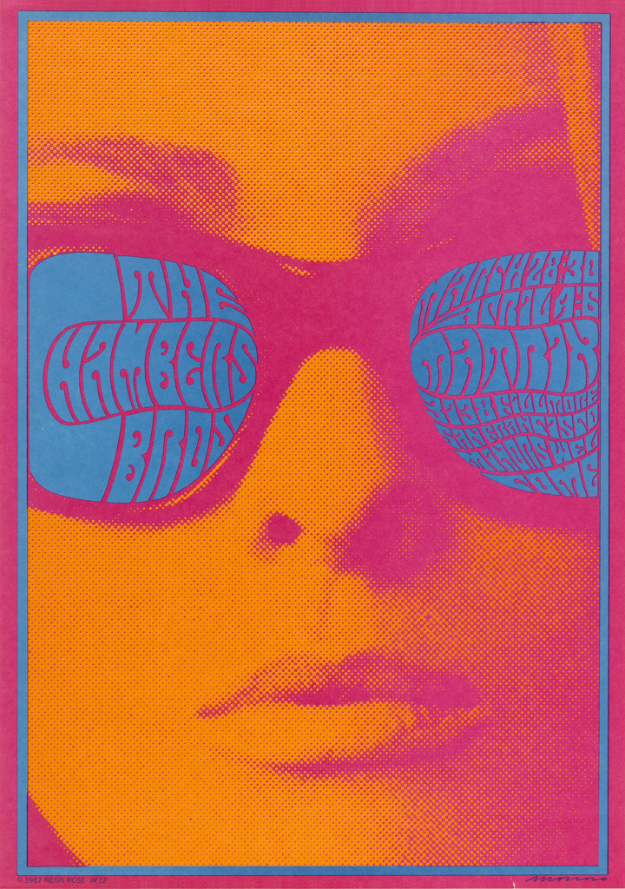
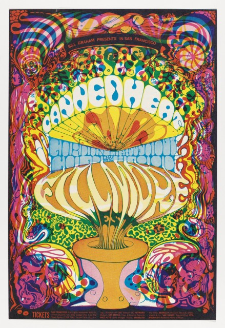

# Psychedelic Poster Design

[Home](../README.md)

## What it is

Psychedelic poster design became associated with the 1960s counterculture and the San Francisco concert scene. Posters for venues such as the Fillmore and Avalon Ballroom communicated the atmosphere of a musical community as well as advertising performances. Designers combined influences from Art Nouveau's flowing forms and Optical Art's visual effects. [Cooper Hewitt's historical overview](https://www.cooperhewitt.org/2013/12/16/psychedlic-promotion/) explains this connection between the posters and their audience.

The style challenges modernist expectations of restrained layouts and immediately readable information. In Victor Moscoso's work, intense color combinations and elaborate lettering deliberately made viewers spend longer decoding the message. [Cooper Hewitt's analysis](https://www.cooperhewitt.org/2013/01/29/good-vibrations/) describes that reversal of conventional advertising practice. For this page, I interpret psychedelic design as a challenge to modernist clarity and a precursor to later postmodern experimentation, rather than assuming every psychedelic poster belongs to one fixed historical category.

## Recognize and apply it

The applications below are my proposed adaptations of the historical examples, not claims about measured website performance.

| Visual feature | When and why to use it | How to apply it in a hero |
|---|---|---|
| **Intense, contrasting colors** | Useful when an event or creative brand needs an energetic atmosphere. Adjacent saturated colors can create a sense of visual vibration. | Use a vivid palette in the illustration or background, with a quiet area behind the supporting copy and CTA. |
| **Flowing, distorted lettering** | Useful when a short title should also function as an expressive image. Letters can curve, expand, and fit together into a larger shape. | Give the headline a custom curved treatment, but keep it understandable. Use simple lettering for details and the action button. |
| **Dense organic patterns and integrated imagery** | Useful when the design should reward exploration or suggest an imaginative world. Faces, swirls, and words can share the same visual space. | Place detailed illustration around the outer edges or inside one image panel, leaving enough open space to explain the offer. |

This approach could suit a music festival, illustration workshop, or creative community. A hero still needs to tell visitors what is offered and what to do next. I would borrow the expressive atmosphere while making essential information easier to read than it is in some historical posters.

## Historical examples

### 1. Victor Moscoso — *Chambers Brothers Band (Neon Rose #12)*, 1967

- **Creator:** Victor Moscoso.
- **Title and date:** *Chambers Brothers Band (Neon Rose #12)*, **1967**.
- **Institution and source:** Cooper Hewitt, Smithsonian Design Museum; Caitlin Condell's article, “Good Vibrations.”
- **Direct source and viewing link:** [Cooper Hewitt — Good Vibrations](https://www.cooperhewitt.org/2013/01/29/good-vibrations/).
- **Image credit:** Artwork by Victor Moscoso; image provided by Cooper Hewitt, Smithsonian Design Museum.
- **Downloaded image:** [Cooper Hewitt image file](https://www.cooperhewitt.org/wp-content/uploads/2013/01/38629_c9a9b7a1abbaaa83_b.jpg).

**What I observe:** The face fills almost the entire poster. Pink and orange dots create its shading, while the sunglasses provide two blue shapes for the lettering. The curved words follow the lenses, turning event information into part of the portrait rather than a separate caption.

**How I would adapt it in a hero:** I would use a bold illustrated portrait or object with a short headline fitted into one intentional shape. The detailed offer and CTA would sit outside that shape on a plain background. This would preserve the connection between lettering and imagery without requiring visitors to decode every sentence.

### 2. Lee Conklin — Concert poster for Canned Heat, Gordon Lightfoot, and Cold Blood, 1968

- **Creator:** Lee Conklin.
- **Work and date:** Concert poster advertising **Canned Heat, Gordon Lightfoot, and Cold Blood**, **1968**. This is a descriptive identification of the poster used in the museum article.
- **Institution:** Cooper Hewitt, Smithsonian Design Museum; the article identifies the poster as part of its collection.
- **Direct source and viewing link:** [Cooper Hewitt — Psychedlic Promotion](https://www.cooperhewitt.org/2013/12/16/psychedlic-promotion/) by Kristina Parsons. The link retains the article's published spelling.
- **Image credit:** Artwork by Lee Conklin; image provided by Cooper Hewitt, Smithsonian Design Museum.
- **Downloaded image:** [Cooper Hewitt image file](https://www.cooperhewitt.org/wp-content/uploads/2013/12/1979-34-5.jpg).

**What I observe:** The central lettering expands into a rounded shape above an urn-like base. The large pale words stand out from a tightly packed border of colored figures and spirals. The composition has a strong central axis, but its smaller details keep the surrounding area visually busy.

**How I would adapt it in a hero:** I would frame a central headline and product image with flowing illustrated shapes. A plain panel beneath the headline would contain the offer and CTA. This would use the poster's expressive border and central emphasis while giving the visitor a clear place to act.

## Sources

The museum articles support the historical information and identification of the works. “What I observe” and hero applications are interpretations of the pictured designs.

- [Caitlin Condell, Cooper Hewitt — Good Vibrations](https://www.cooperhewitt.org/2013/01/29/good-vibrations/), January 29, 2013: Moscoso, color, lettering, and the 1967 poster.
- [Kristina Parsons, Cooper Hewitt — Psychedlic Promotion](https://www.cooperhewitt.org/2013/12/16/psychedlic-promotion/), December 16, 2013: counterculture context, stylistic influences, and Conklin's 1968 poster.

Images downloaded from Cooper Hewitt for this project. Both reproduce historical works; neither is AI-generated.
