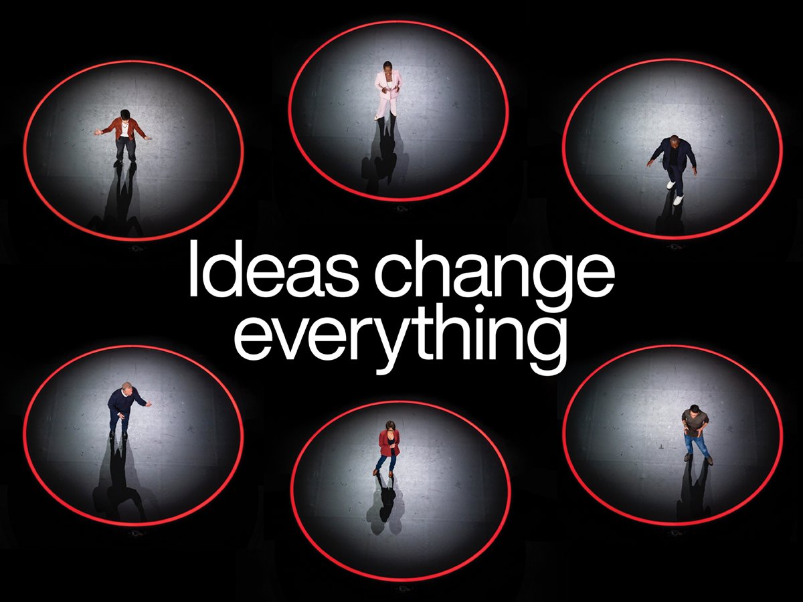

# The Sage

[Home](../README.md)

## What it is

The Sage is an archetype centered on understanding, knowledge, and the search for truth. A Sage brand helps people investigate questions, make sense of information, and reach informed conclusions. Its promise is to make the audience more capable through learning.

[Carol S. Pearson's description](https://carolspearson.com/archetype-pages/sage-archetype) connects the Sage with research, reflection, expertise, and sharing knowledge. She also identifies risks such as dogmatism and emotional distance. In branding, I interpret this as a need to explain clearly and remain open to questions rather than simply sound authoritative. An archetype is a creative framework, not a personality diagnosis.

## Audience motivations

The following are audience needs I would address when designing a Sage brand:

| Motivation | What the audience needs from the brand |
|---|---|
| **Understand something unfamiliar** | Clear explanations, definitions, and examples that make a difficult subject approachable. |
| **Know what to trust** | Named sources, evidence, and a clear distinction between fact and interpretation. |
| **Make an informed decision** | Comparisons and reasoning that explain why an option fits their situation. |
| **Become more independent** | Useful methods and resources they can apply without relying on someone else for every answer. |

Possible frustrations include confusing jargon, unsupported claims, and explanations that assume too much prior knowledge. The brand should respect curiosity and make asking questions feel welcome.

## Recognize and apply it

These are proposed design choices, not rules that every Sage brand must follow.

| Cue | How I would use it | Why it fits |
|---|---|---|
| **Purposeful learning imagery** | Show an annotated example, diagram, reference material, or someone explaining an idea. | It demonstrates how knowledge is shared instead of using a decorative symbol of intelligence. |
| **Clear visual hierarchy** | Use descriptive headings, readable body text, consistent spacing, and clearly labeled sections. | The visitor can find information and follow the reasoning. |
| **Visible evidence** | Place source links and relevant author information beside claims. | The audience can investigate the explanation rather than accept it on appearance alone. |
| **Patient, precise language** | Use words such as “understand,” “compare,” “explore,” and “explain.” Define technical terms when needed. | It invites learning without making the audience feel uninformed. |
| **Specific calls to action** | Use labels such as “Read the worked example” or “Download the source checklist.” | The visitor knows what useful information comes next. |

## When to use it

The Sage is useful for educational resources, reference services, research tools, and brands that help people understand complex choices. It works best when the organization can demonstrate knowledge and make that knowledge useful.

Avoid presenting opinions as facts, inventing credentials, or using academic language merely to sound impressive. A thoughtful Sage should acknowledge uncertainty and explain how a conclusion was reached.

## Real brand examples

The examples below are my interpretations of the brands' published activities and communication. Neither source is a claim that the organization officially identifies itself as a Sage brand.

### 1. TED — sharing ideas that build understanding

- **Brand:** TED.
- **Direct brand source:** [About TED](https://www.ted.com/about).
- **Image and context:** Graphic accompanying the April 8, 2024 announcement of TED's new tagline, [“Ideas Change Everything”](https://blog.ted.com/ideas-change-everything/).
- **Image credit:** TED; graphic published on the official TED Blog. Individual image creators are not identified in the article.

**What the brand says:** TED describes its mission as discovering and sharing ideas that deepen understanding and encourage meaningful change. Its 2024 tagline announcement emphasizes the work behind speakers' ideas and invites continued learning.

**Why I interpret it as Sage:** TED makes explanations and perspectives accessible through talks. The Sage connection comes from sharing knowledge and encouraging people to reconsider what they understand. An engaging presentation still needs evidence; the TED name alone does not establish the accuracy of every claim.

**What I observe in the image:** A large, simple headline dominates the center. Repeated red circles connect different speakers into one visual system, while the dark background limits distractions. People are shown presenting ideas rather than displaying a physical product.

**How I would adapt it:** I would pair a short learning-focused headline with a preview of the explanation or resource. A restrained accent color could connect the imagery to a CTA such as “Explore the explanation.”

### 2. Grammarly Business — selling expert writing guidance

- **Brand:** Grammarly Business.
- **Marketing material and source:** [Official Grammarly Business sales brochure (PDF)](https://www.grammarly.com/business/overview-one-pager.pdf).
- **Image credit:** Grammarly; this image is a rendering of its published brochure.

**What it sells:** Writing-assistance software for business teams. The brochure connects clearer, more consistent communication with workplace benefits and ends with “Try Grammarly Business Today,” directing readers to contact a representative or sign up online. This is a published brochure reference, not a statement of current plans or offers.

**Why I interpret it as Sage:** Grammarly presents its product as a knowledgeable coach. It demonstrates suggestions and explains how assistance improves correctness, clarity, engagement, and delivery. The selling appeal is that expert guidance helps the customer communicate more capably and confidently.

**What I observe in the image:** Blue and green sections organize explanations, product screenshots, and numbered features. Visible writing suggestions demonstrate the service, while the final CTA turns the explanation into a sales invitation.

**How I would adapt it:** I would show an annotated example of the problem my resource solves, explain the lesson, and place a specific CTA after that demonstration.

## Applying the Sage to my project

For a possible student resource about evaluating online sources, I could use:

- **Headline:** “Understand the evidence behind the claim.”
- **Supporting copy:** “Use a simple checklist to examine an article's author, evidence, and original sources.”
- **CTA:** “Download the source checklist.”
- **Intended destination:** The checklist download. This is proposed project copy, not an existing service or a quotation from either brand.

[Constructivism](constructivism.md) could provide directional shapes and strong emphasis for the headline. [New Wave Typography](new-wave-typography.md) could suggest investigation through layered notes and imagery. In either style, I would keep the explanation and CTA easy to read. The Sage motivation can remain consistent across different visual styles.

## Remaining archetype-package work

This page contains the Sage research and real-brand references. The full assignment will also need a finalized brief, four original heroes crossing two styles with two persuasion principles, explanations beneath each hero, a strongest-hero comparison, key prompts, and a rejected draft with revision notes. The reference images above are not the four original hero deliverables.

## Sources

- [Carol S. Pearson — Sage Archetype](https://carolspearson.com/archetype-pages/sage-archetype): the Sage's motivations, organizational strengths, and potential weaknesses.
- Margaret Mark and Carol S. Pearson, *The Hero and the Outlaw* (McGraw-Hill, 2001): the branding framework identified in the assignment's reference material.
- [TED — About](https://www.ted.com/about): its mission and focus on sharing ideas.
- [TED Blog — Introducing TED's new tagline](https://blog.ted.com/ideas-change-everything/): 2024 message and reference graphic.
- [Grammarly — Business sales brochure (PDF)](https://www.grammarly.com/business/overview-one-pager.pdf): product marketing, writing-assistance demonstrations, and signup CTA.

Brand interpretations, design applications, and sample copy are original proposals based on these sources.
